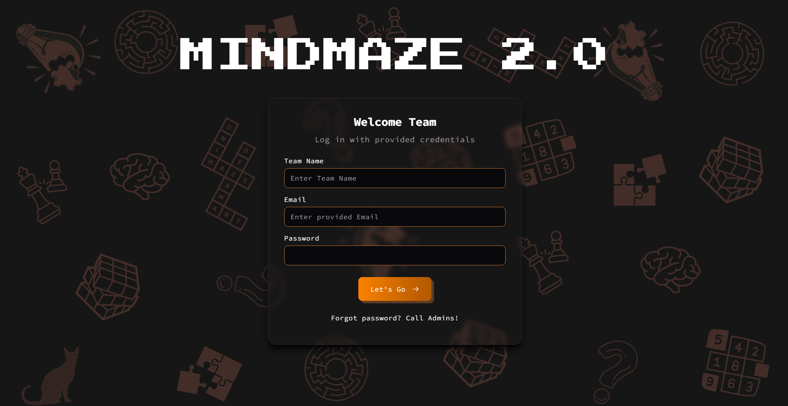
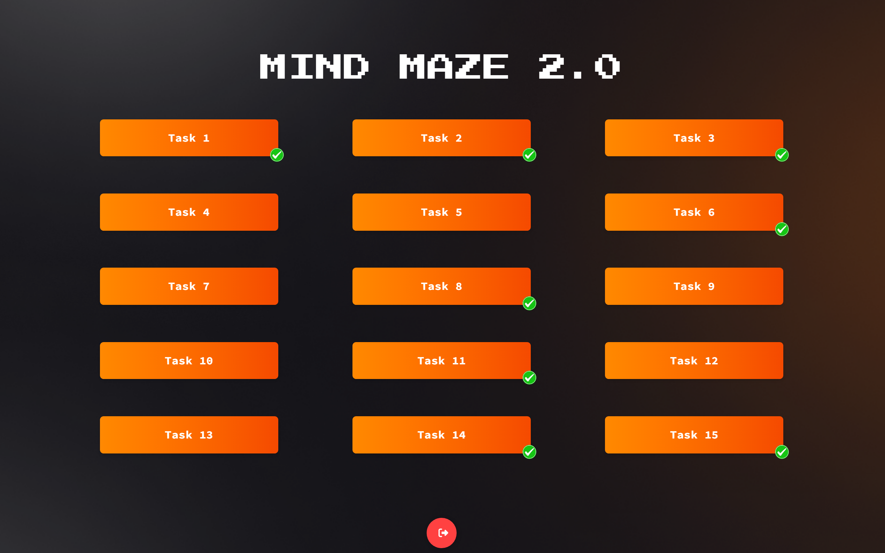
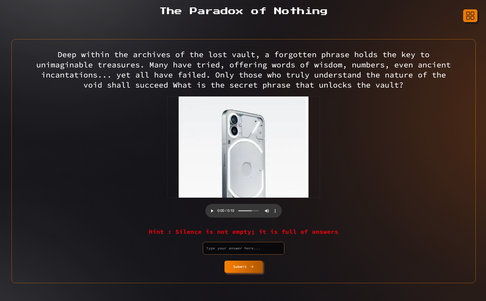
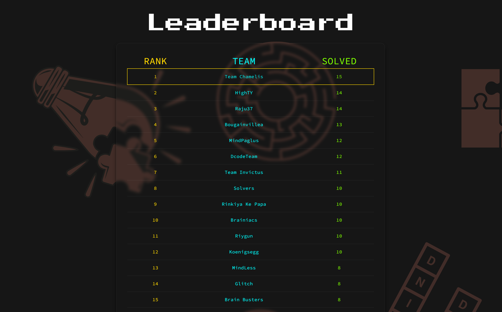

# 🧠 MindMaze 2.0
> A Low-Latency, Real-Time Interactive Quiz & Puzzle Platform Built for Scale.

MindMaze 2.0 is a production-grade, highly engaging **real-time quiz and puzzle platform** built for large-scale live events. Engineered for minimal latency, it features instant score updates, offline-resilient client-side state caching, and dynamic multi-device synchronization.

During a live event, the platform successfully orchestrated and handled **~7,000 real-time submissions** with perfect uptime and fluid visual feedback.

---

## 🚀 Tech Stack

[](https://nextjs.org/)
[](https://react.dev/)
[](https://supabase.com/)
[](https://tailwindcss.com/)
[](https://github.com/pmndrs/zustand)
[](https://www.typescriptlang.org/)

---

## 📋 Table of Contents
- [🎨 Application Visual Guide](#-application-visual-guide)
  - [1. Team Authentication Portal](#1-team-authentication-portal)
  - [2. Interactive Quest Grid](#2-interactive-quest-grid)
  - [3. Riddle Arena & Multimedia Player](#3-riddle-arena--multimedia-player)
  - [4. Real-Time Leaderboard](#4-real-time-leaderboard)
- [⚡ Key Features & Technical Deep Dive](#-key-features--technical-deep-dive)
- [🏗️ System Architecture](#%EF%B8%8F-system-architecture)
- [🗄️ Database & Schema Design](#%EF%B8%8F-database--schema-design)
- [🔌 API Endpoint Reference](#-api-endpoint-reference)
- [🛠️ Getting Started & Installation](#%EF%B8%8F-getting-started--installation)

---

## 🎨 Application Visual Guide

### 1. Team Authentication Portal
> **Design Aesthetic:** Immersive retro console interface blending deep obsidian background overlays, retro pixel-art vectors, and vibrant neon-orange borders. A glassmorphic login card hosts interactive input fields with micro-animations.
> **User Flow:** Teams authenticate using credentials provided by event coordinators. The login handler checks active session limits to prevent multiple device connections for the same account.



### 2. Interactive Quest Grid
> **Design Aesthetic:** Minimalist dark dashboard with a symmetric 3x5 orange-to-red gradient task card layout. Completed tasks are overlayed dynamically with a checkmark icon to clearly show progress.
> **User Flow:** Once logged in, teams view their progress grid. Clicking any active task card triggers a smooth navigation sequence into the puzzle page.



### 3. Riddle Arena & Multimedia Player
> **Design Aesthetic:** A focused, high-immersion view with gold-orange bordered question containers. The central content area handles rich embedded media elements (images, video, and audio players) with a retro styled text input.
> **User Flow:** Teams read the riddle, review hints, play the media, type their answer, and submit it. Hashed answer verification runs instantly.



### 4. Real-Time Leaderboard
> **Design Aesthetic:** Vibrant neon headers (Rank in Gold, Team in Cyan, Solved in Lime Green) on a translucent glass card. Celebratory fireworks burst using `fireworks-js` when teams achieve total victory.
> **User Flow:** A global, live leaderboard showing real-time ranking and solved counts of all teams, synced instantly using Supabase postgres changes websocket subscription.



---

## ⚡ Key Features & Technical Deep Dive

### 🏎️ Live Real-Time Updates
The global leaderboard synchronizes live changes instantly without reloading. It relies on a Supabase Realtime socket subscription channel (`postgres_changes` on the public `leaderboard` table/view) that receives incremental updates and sorts them on-the-fly, giving participants live status indicators.

### 🛡️ Hybrid Client-Side Cryptographic Verification
To eliminate network latency overhead while maintaining event integrity:
- Puzzles answers are retrieved from the database as cryptographic hashes.
- User input is sanitized (trimmed & normalized to lowercase) and compared client-side using `bcryptjs` (`bcrypt.compareSync`).
- This ensures answers cannot be extracted by inspecting the client's network payload or global state objects, while keeping server resources free from heavy computation validation spikes.

### 🔄 Multi-Device Login Blocker (Session Guard)
To prevent team password sharing and maintain event fairness:
- Logins require registering a unique active session record in the database tracking the authentication refresh token.
- Concurrency middleware queries active sessions and immediately blocks duplicate logins, forcing participants to sign out of other devices before logging in.

### 💾 Resilient Offline Caching & Zustand Persistence
State is managed cleanly using Zustand. To ensure players do not lose progress or active input text during accidental page refreshes, the question storage is mounted with Zustand's `persist` middleware configured with `localStorage` fallback.

### ⚙️ Administrative Provisioning Pipeline
Includes a secure Next.js Serverless Route (`/api/admin/create-user`) which allows admins to mass-register teams. It leverages the private `SUPABASE_SERVICE_ROLE_KEY` to bypass sign-up restrictions, register authentication profiles, and write credentials securely.

---

## 🏗️ System Architecture

```mermaid
graph TD
    subgraph Client [Client-Side App]
        React[React / Next.js SPA]
        Zustand[Zustand Store + localStorage]
        Bcrypt[bcrypt.js Verification Engine]
        Fireworks[fireworks-js Animation Engine]
    end

    subgraph Server [Next.js Route Handlers]
        CreateUser[/api/admin/create-user]
    end

    subgraph Supabase [Supabase Backend]
        Auth[Supabase Auth Service]
        Realtime[Supabase Realtime Sockets]
        DB[(PostgreSQL Database)]
    end

    React -->|1. Authenticate| Auth
    React -->|2. Check/Write Session| DB
    React -->|3. Fetch Questions & Hashes| DB
    React -->|4. Store Offline State| Zustand
    React -->|5. Verify Input| Bcrypt
    Bcrypt -->|6. If Correct, Log Solve| DB
    DB -->|7. Trigger DB Changes| Realtime
    Realtime -->|8. Push Live Updates| React
    React -->|9. Trigger Victory Blast| Fireworks
    CreateUser -->|Secure Onboarding| Auth
    CreateUser -->|Seed Team Data| DB
```

---

## 🗄️ Database & Schema Design

Below is the DDL schema structure detailing the primary tables in the Supabase PostgreSQL cluster:

```sql
-- Teams Table: Core team data and game progress stats
CREATE TABLE public.teams (
    id UUID PRIMARY KEY REFERENCES auth.users(id) ON DELETE CASCADE,
    team_name VARCHAR(255) NOT NULL UNIQUE,
    email VARCHAR(255) NOT NULL UNIQUE,
    password VARCHAR(255) NOT NULL, -- Hashed team password
    current_question_id INT DEFAULT 0,
    questions_solved INT DEFAULT 0,
    has_submitted BOOLEAN DEFAULT FALSE,
    refresh_token TEXT,
    created_at TIMESTAMP WITH TIME ZONE DEFAULT timezone('utc'::text, now()) NOT NULL
);

-- Sessions Table: Limits concurrent active devices per account
CREATE TABLE public.sessions (
    id TEXT PRIMARY KEY, -- Tracks refresh token
    team_id UUID REFERENCES public.teams(id) ON DELETE CASCADE,
    email VARCHAR(255),
    created_at TIMESTAMP WITH TIME ZONE DEFAULT timezone('utc'::text, now()) NOT NULL
);

-- Questions Table: Contains quiz prompt resources and media details
CREATE TABLE public.questions (
    id INT PRIMARY KEY,
    question_text TEXT NOT NULL,
    question_description TEXT NOT NULL,
    media_image TEXT[], -- Media arrays containing URLs
    media_video TEXT[],
    media_audio TEXT[],
    hint TEXT,
    correct_answer TEXT -- Bcrypt hashed answer text
);

-- Submissions Table: Event audit log for all submission attempts
CREATE TABLE public.submissions (
    id SERIAL PRIMARY KEY,
    team_id UUID REFERENCES public.teams(id) ON DELETE CASCADE,
    question_id INT REFERENCES public.questions(id) ON DELETE CASCADE,
    submitted_answer TEXT NOT NULL,
    is_correct BOOLEAN NOT NULL,
    team_name VARCHAR(255) NOT NULL,
    submitted_at TIMESTAMP WITH TIME ZONE DEFAULT timezone('utc'::text, now()) NOT NULL
);

-- Solved Questions Table: Fast lookup tracker for checking verified solutions
CREATE TABLE public.solved_questions (
    id SERIAL PRIMARY KEY,
    team_id UUID REFERENCES public.teams(id) ON DELETE CASCADE,
    question_id INT REFERENCES public.questions(id) ON DELETE CASCADE,
    team_name VARCHAR(255) NOT NULL,
    solved_at TIMESTAMP WITH TIME ZONE DEFAULT timezone('utc'::text, now()) NOT NULL
);
```

---

## 🔌 API Endpoint Reference

### Admin Operations

#### 1. Onboard Team User
`POST /api/admin/create-user`
* **Description:** Securely registers a new team auth account and writes the corresponding profile to the public database.
* **Headers:** Requires administrative access env privileges.
* **Request Payload:**
```json
{
  "email": "teamname@example.com",
  "password": "SecurePassword123!",
  "team_name": "Team Chamelis"
}
```
* **Success Response:**
```json
{
  "ok": true,
  "user": {
    "id": "e8e50bdf-fc01-4c6e-8217-bfd28a5fa3d6",
    "email": "teamname@example.com"
  }
}
```

---

## 🛠️ Getting Started & Installation

### Prerequisites
- Node.js (v18 or higher recommended)
- Supabase account & project instance

### 1. Installation
Clone the repository and install the development dependencies:
```bash
git clone https://github.com/bhikrant7/Mindmaze-2.0.git
cd MindMaze
npm install
```

### 2. Configure Environment Variables
Create a `.env` file at the root of the project:
```env
NEXT_PUBLIC_SUPABASE_URL=https://your-project-id.supabase.co
NEXT_PUBLIC_SUPABASE_PUBLISHABLE_DEFAULT_KEY=your-supabase-anon-key
SUPABASE_SERVICE_ROLE_KEY=your-supabase-service-role-key
```

### 3. Database Seeding
Register seed teams and players dynamically in your database instance:
```bash
npm run seed
```

### 4. Running the Development Server
Launch the local Turbopack client server:
```bash
npm run dev
```
Open [http://localhost:3000](http://localhost:3000) in your browser to view the application.
